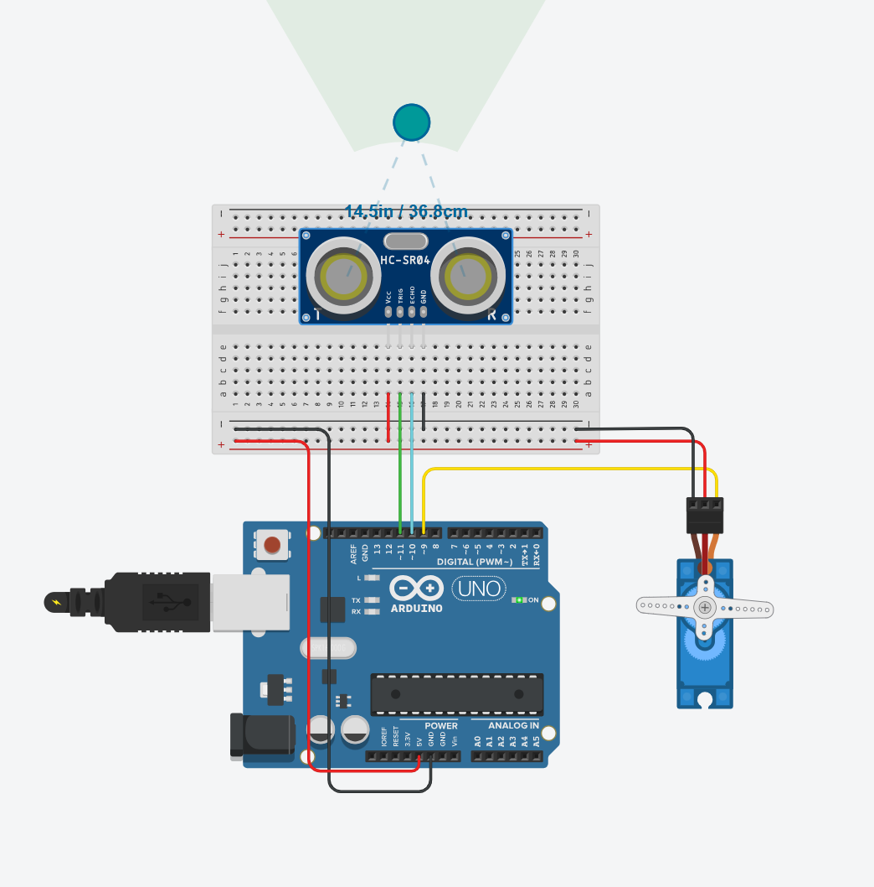
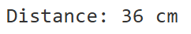

# SenseDrive-Arduino

A collection of two Arduino-based sensor and actuator systems designed for **automation** and **interactive control**. Both projects simulate real-life robotics scenarios and are fully tested on Tinkercad.

---

## Table of Contents

1. [4-Motor DC Control System](#4-motor-dc-control-system)
2. [Ultrasonic Servo Obstacle Avoider](#ultrasonic-servo-obstacle-avoider)

---

## 4-Motor DC Control System

This project controls **4 DC motors** using an **L293D motor driver IC** and an **Arduino UNO**.

The motors perform a pre-defined sequence of movements:
1. Move **forward** for 30 seconds
2. Move **backward** for 60 seconds
3. Alternate **right and left turns** (6 times, 5 seconds each)
4. Repeat the sequence continuously


### Components Used:
- Arduino UNO
- L293D motor driver IC
- 4 × DC motors
- 9V battery (×1)
- Breadboard + jumper wires


### Wiring Overview:
| Component        | Arduino Pin / Source     |
|------------------|---------------------------|
| IN1 (Motor 1)     | D2                        |
| IN2 (Motor 1)     | D3                        |
| IN3 (Motor 2)     | D4                        |
| IN4 (Motor 2)     | D5                        |
| VCC1 (Logic – Pin 16) | 5V Arduino            |
| VCC2 (Motor Power – Pin 8) | 9V Battery (+)   |
| GND (Pins 4, 5, 12, 13) | Arduino GND + Battery GND |
| EN1 & EN2         | Connected to 5V (enabled) |


### Behavior Description:
- Motors rotate in the **same direction** during forward motion.
- During backward motion, they reverse.
- During right turn, only the first motor runs.
- During left turn, only the second motor runs.
- The sequence loops continuously.


### Tinkercad Simulation Link
Click to view and run the full simulation:   
[Tinkercad Project](https://www.tinkercad.com/things/5t2ImNg5Ji4-mighty-kasi-esboo)


#### Notes:
> Some motors are wired in reverse — the code accounts for this by inverting the signals for consistent motion.
> For more stable performance, use a higher current power supply (e.g., 7.4V Li-ion).

---

## Ultrasonic Servo Obstacle Avoider
This Arduino-based system uses an **HC-SR04 ultrasonic sensor** to detect nearby obstacles. When an object is detected within **10 cm**, the **servo motor** reacts by changing its angle to avoid or respond to the object. This demonstrates a basic collision avoidance mechanism often used in robotics.


### Components Used
- Arduino Uno
- HC-SR04 Ultrasonic Sensor
- Servo Motor
- Breadboard + jumper wires
- Powered via USB


### System Behavior
````cpp
if (distance > 10) {
  servo.write(90);  // No obstacle
} else {
  servo.write(0);   // Obstacle detected
}

````

### Pin Configuration
| Component     | Arduino Pin |
|---------------|-------------|
| Trig (Sensor) | D11         |
| Echo (Sensor) | D10         |
| Servo Signal  | D9          |
| VCC/GND       | 5V & GND    |


### Simulation Screenshots
Below are four key stages of the simulation:

1. Initial Setup  
<p align="center">
  
</p>

2. Object Detected at 9 cm  
<p align="center">
  
</p>

3. Object Moved Away (36 cm)  

<p align="center">
  
</p>

4. Servo Rotation Based on Distance  
<p align="center">
  
</p>


### Tinkercad Simulation Link
Click to view and run the full simulation:   
[Tinkercad Project](https://www.tinkercad.com/things/8CoLH3r93RO-incredible-allis-wolt)
